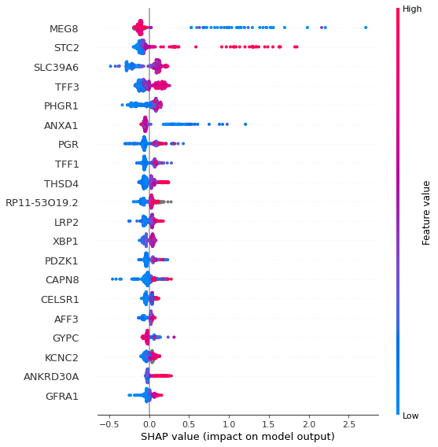

# Predicting Gene Expression and Explaining Gene Interactions Using Single Cell Data

The best understanding of the project for an outsider is probably gained through `progress_report.md`

This project uses XGBoost to predict the expression of genes of interest from single cell data from the tumors of breast cancer patients. The models are analyzed using shapley values to measure the importance of each gene in predicting the expression of the target gene. 

Most code will only run on the `med-biostat`servers due to the data being stored there.

## Overview of files:
### Functions and clases
- `Notebooks/src/` - Folder containing source code for the models including data selection, model building, and cross validation
    - `data_handling.py` - contains VariableSelector class that performs data selection and variable selection for a range of different parameters
    - `model_builder.py` - contains CellLevelModel class used for building models for a cell type and for multiple target genes. Also performs shapley analysis.
    - `model_selection.py` - XGBGridSearch class used for tuning the models. 
    - `modules.py` various plotting functions
### Notebooks
- `Baseline Models` : linear regression to provide baseline. Not complete.
- `Classification - model builder` : simplification of the problem to make it a binary or 3 class problem. 
- `Regression - differentially expressed` : Removing close to zero expression samples of target gene improves prediction. 
- `Regression - all samples` : Poorly performing models using all samples. 
- `Removing low quality cells` : sample elimination based on nUMI and nGene. 
- `SHAP analysis` : analysis of the interaction
- `Tuning` tuning of the cancer cell models for best score on each target gene. 


## Example use of code
All the data is stored at `/data/severs/` at the med-biostat server. The following code will not execute if you do not execute it on these servers.  
```python
import src.model_builder as mb

model = mb.CellLevelModel("Cancer", target_genes=["ESR1", "CDK4"]])

model.build_datasets()

params = {'objective': 'reg:squarederror',
 'learning_rate': 0.04,
 'max_depth': 4,
 'min_child_weight': 5,
 'n_estimators': 1000,
 'verbosity': 0,
 'seed': 1,
 'silent': True}

# Build models for each gene, performing 5 fold cross validation and building a single predictive model

model.build_model(params, cv=5, build_single_model=2)
# build_single_model=2 makes it have a train, test, and validation set. 1 is only train and validation.
model.plot_results("ESR1")
```


```python
model.shap_analysis()
model.shap_summary("ESR1")
```

