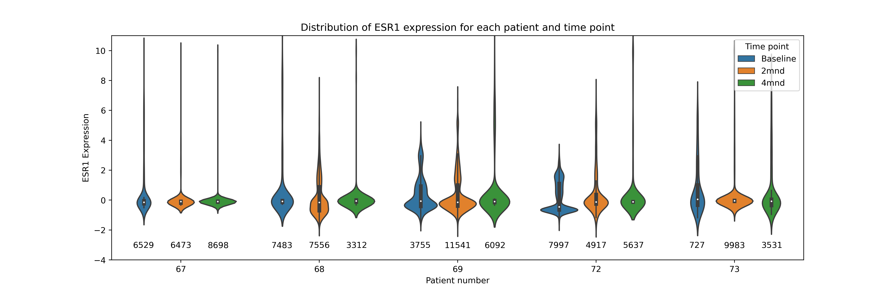
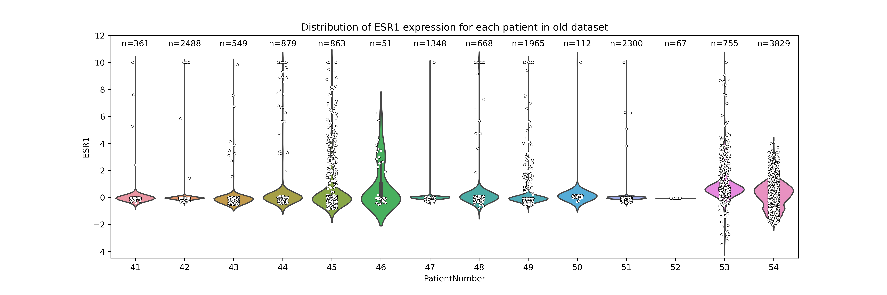
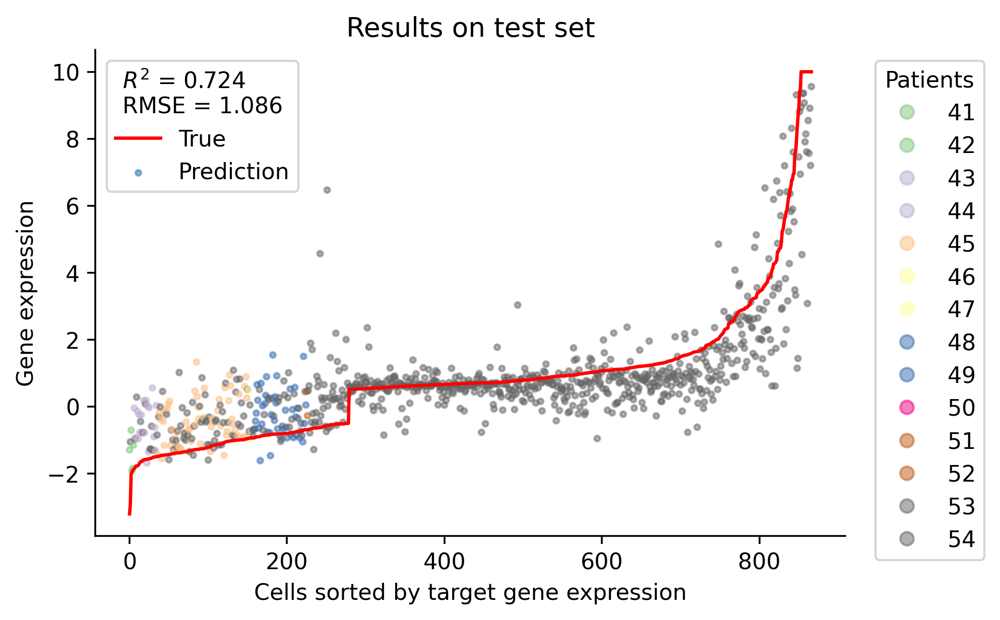
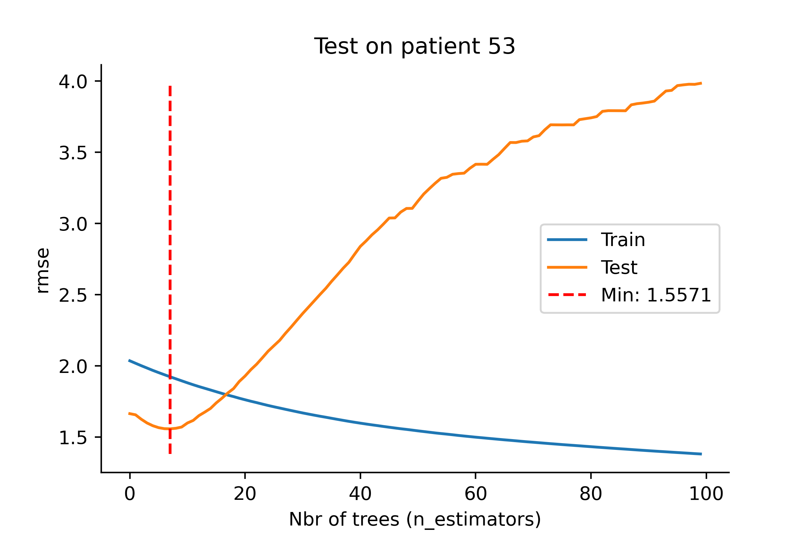

# Progress report

## Predict on positive part of new data
The models for the differentially expressed subset of the data (ESR1_expression > |0.5|) that are trained on the old dataset are not able to predict the expression of the cells in the new dataset. Exactly the same results occur if we use a model trained on the positive part of the old dataset and predict on postive part on the baseline in the new dataset (ESR1_expression > 0.5). 

### Results on old dataset

### Results on new dataset

## Training models on the new dataset
Completed grid search on baseline. Used differentially expressed cells i.e. |ESR1 exp|>0.5. 
Data split using and tuned on `X_train` with 1000 input genes: 

`X_train, X_test, X_val, y_train, y_test, y_val = modules.train_test_val_split(X, y, random_state=10)`

BEST_PARAMATERS:
- max_depth  :  3
- min_child_weight  :  1
- subsample  :  0.8
- eta  :  0.02

The tuning took 1 hour 49  minutes.

This is currently rerun with a finer grid and lower learning rates.
Using: 
`X_train, X_test, X_val, y_train, y_test, y_val = modules.train_test_val_split(X, y, random_state=10)`

`X_train = pd.concat([X_train, X_val])`
`y_train = pd.concat([y_train, y_val])`

## Data distribution
Data is more evenly distributed between patients in the NeoLet dataset than the first dataset. 
Distribution of ESR1 across patients. 

In the first dataset patient 54 has the most cells and the most cells that are differentially expressed.

## Model analysis

To investigate if there is a significant difference between patients we plot the predictions of a model and color them by patient. Patient 53 and 54 represent the majority of the data because they have the most differentially expressed cells.

It is hard to see any significant effect of the patient number. However, they seem to be grouped, but this is because the test set here has a random sample where some patients overrepresent in the negatively expressed.

### Leaving one patient out
I have done this on the first dataset with poor results. Below is the training progress with the test set being patient 53 and only considering differentially expressed cells. The minimum is at MSE=1.56 and we have get MSE around 1.0 when we mix the cells together. We also see here how the model overfits to the patients in the training set. 

