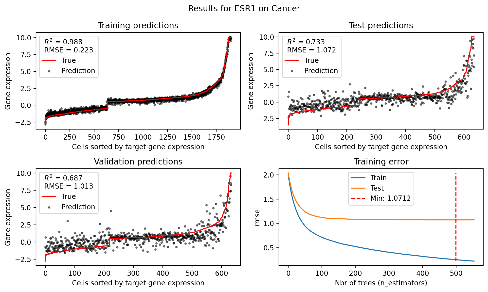
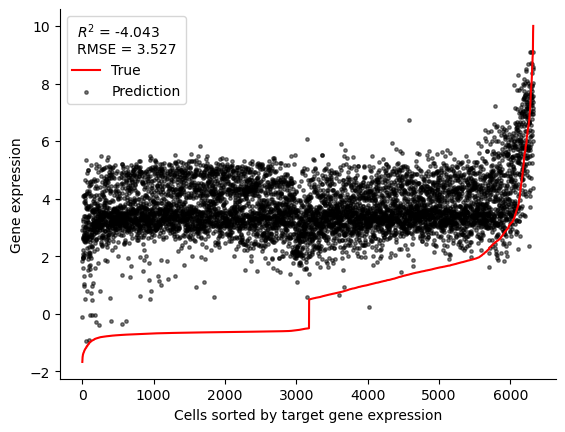

# Progress report

## Predict on positive part of new data
The models for the differentially expressed subset of the data (ESR1_expression > |0.5|) that are trained on the old dataset are not able to predict the expression of the cells in the new dataset. Exactly the same results occur if we use a model trained on the positive part of the old dataset and predict on postive part on the baseline in the new dataset (ESR1_expression > 0.5). 

### Results on old dataset

### Results on new dataset

## Training models on the new dataset
Completed grid search on baseline. Used differentially expressed cells i.e. |ESR1 exp|>0.5. 
Data split using and tuned on `X_train`: 

`X_train, X_test, X_val, y_train, y_test, y_val = modules.train_test_val_split(X, y, random_state=10)`

BEST_PARAMATERS:
- max_depth  :  3
- min_child_weight  :  1
- subsample  :  0.8
- eta  :  0.02